# Memoria Técnica - Parte 1: Entornos de Trabajo 
 
Documentaci¢çón completa de la configuraci¢çón, incidencias resueltas y verificaci¢çón de los entornos para Scala 2.12.21 y Java 17. 
 
--- 
 
## 1.1 Entorno 1 - JupyterLab + Almond Kernel + Scala 2.12.21 
 
### Resoluci¢çón de incidencia con pip y Python 3.12 
Durante la instalación de JupyterLab surgió un problema porque la terminal no reconocía el comando pip. Se solucionó instalando Python 3.12 y ejecutando: 
 
```cmd 
py -3.12 -m pip install jupyterlab 
``` 
 
 
 
### Descarga de Coursier e instalación del kernel Almond 
Se descargó Coursier cs.zip mediante curl y se descomprimió: 
 
```cmd 
curl -Lo cs.zip https://github.com/coursier/launchers/raw/master/cs-x86_64-pc-win32.zip 
tar -xf cs.zip 
``` 
 
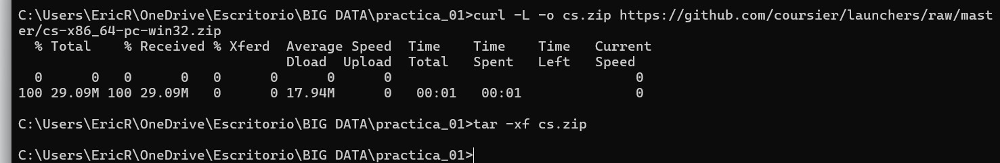 
 
Se instaló y vinculó el kernel interactivo Almond para Scala 2.12.21, comprobando los kernels y la versión del ejecutor: 
 
```cmd 
cs.exe launch --fork almond:latest.release --scala 2.12.21 -- --install 
py -3.12 -m jupyter kernelspec list 
cs.exe launch scala:2.12.21 -- -version 
``` 
 
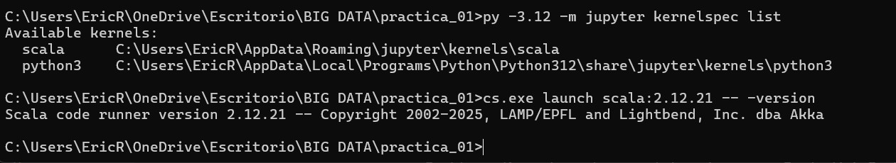 
 
### Apertura de JupyterLab y pruebas en el Notebook 
Se inició el servidor con jupyter lab comprobando la disponibilidad del kernel interactivo de Scala en el Launcher. 
 
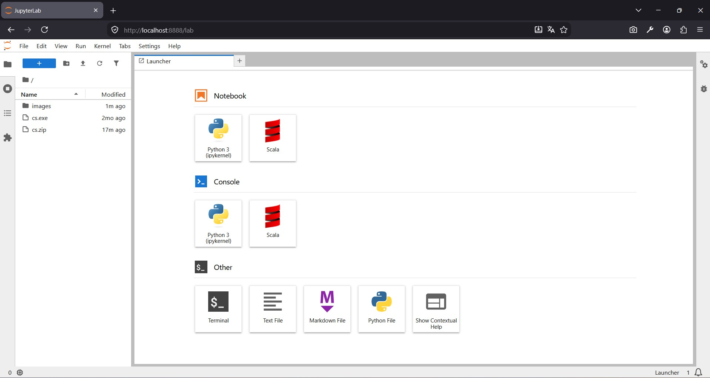 
 
Se ejecutó la instrucción scala.util.Properties.versionString comprobando que utiliza Scala 2.12.21: 
 
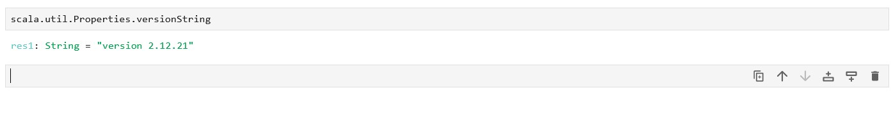 
 
Pruebas básicas de sintaxis ejecutadas en el notebook : 
 
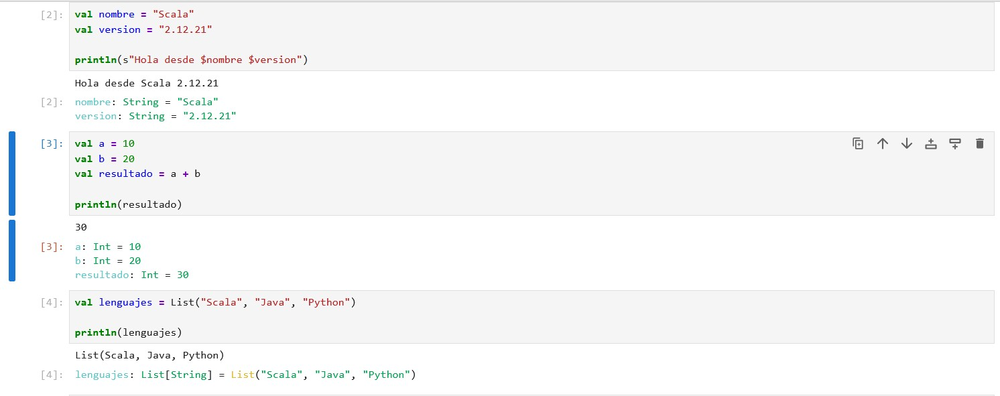 
 
--- 
 
## 1.2 Entorno 2 - Visual Studio Code + Metals + Scala 2.12.21 + JDK 17 + sbt 
 
### Verificación de JDK 17 y sbt 
Se configuró Eclipse Temurin JDK 17 y se verificaron las versiones con java -version, javac -version y sbt --version: 
 
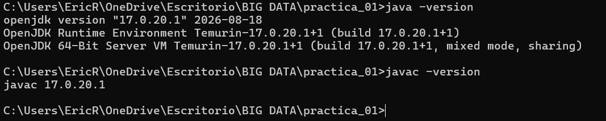 
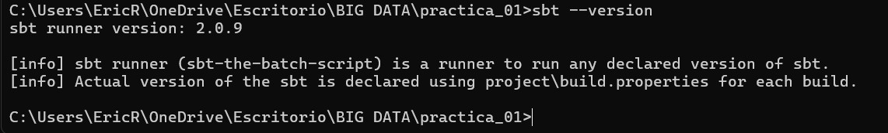 
 
### Instalación de la extensi¢n Metals 
En VS Code se instaló la extensión oficial Scala (Metals): 
 
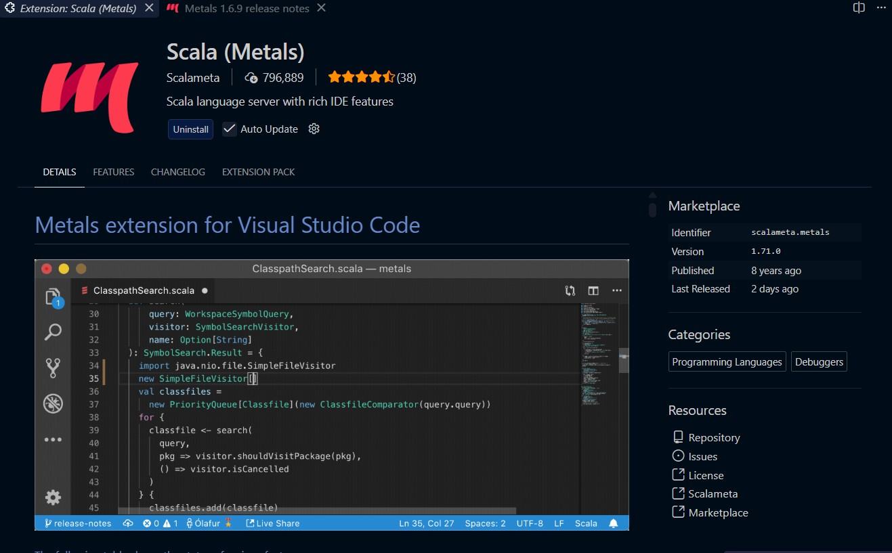 
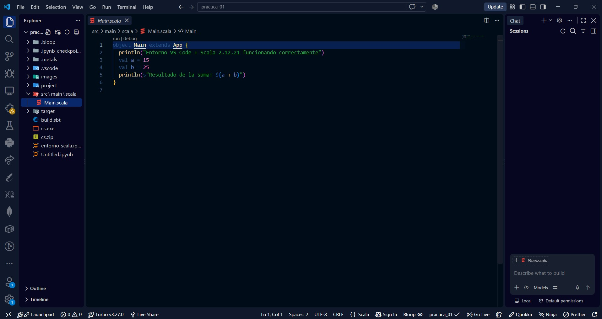 
 
### Configuración de build.sbt y compilaci¢n 
Configuración de build.sbt con nombre, versi¢n y Scala 2.12.21, seguido de compilación exitosa con sbt compile: 
 
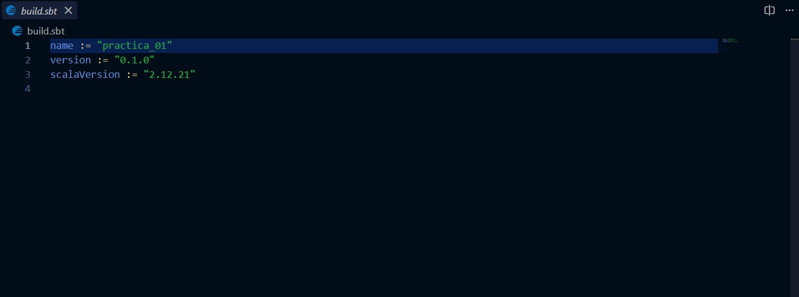 
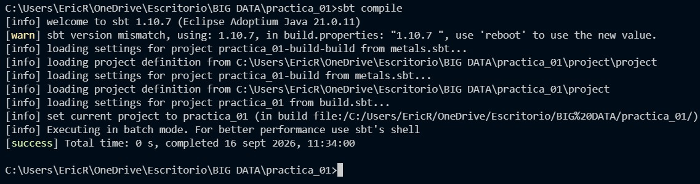 
 
### Ejecución de Main.scala 
Ejecución del programa mediante sbt run dentro de Visual Studio Code: 
 
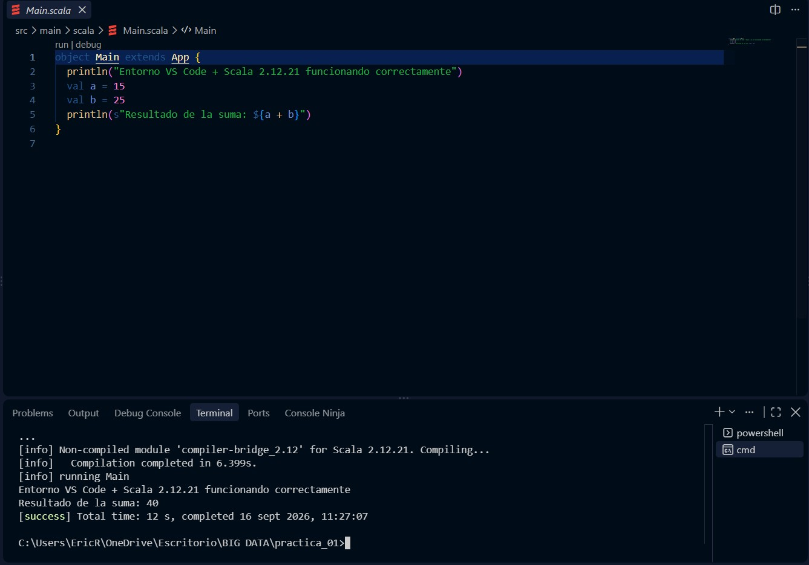 
 
--- 
 
## 1.3 Entorno 3 - IntelliJ IDEA Community + Scala 2.12.21 + sbt 
 
### Instalación y primer inicio 
Instalación y apertura inicial de IntelliJ IDEA en Windows: 
 
 
 
#### Instalación del plugin de Scala 
Instalación y activación del plugin oficial de Scala desde el repositorio de IntelliJ IDEA: 
 
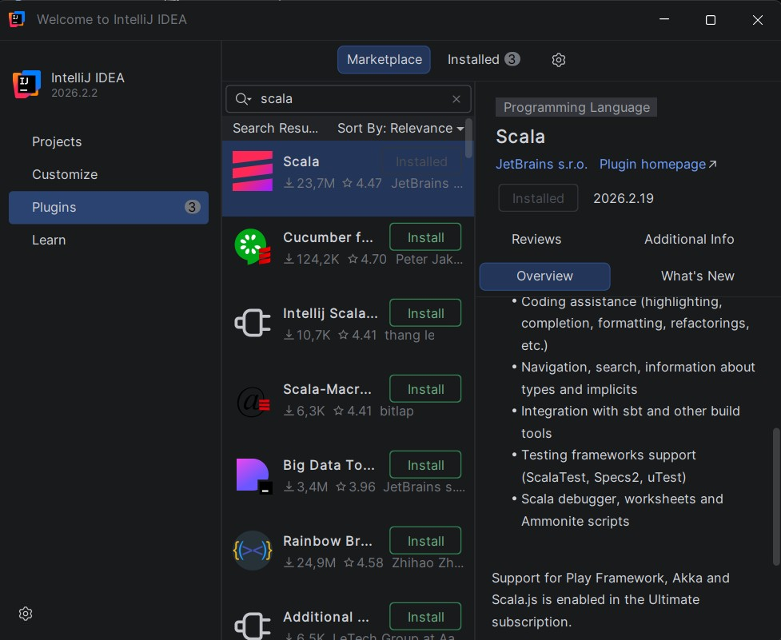 
 
### Configuración del proyecto y build.sbt 
Creación del proyecto sbt scala-intellij con JDK 17 y Scala 2.12.21: 
 
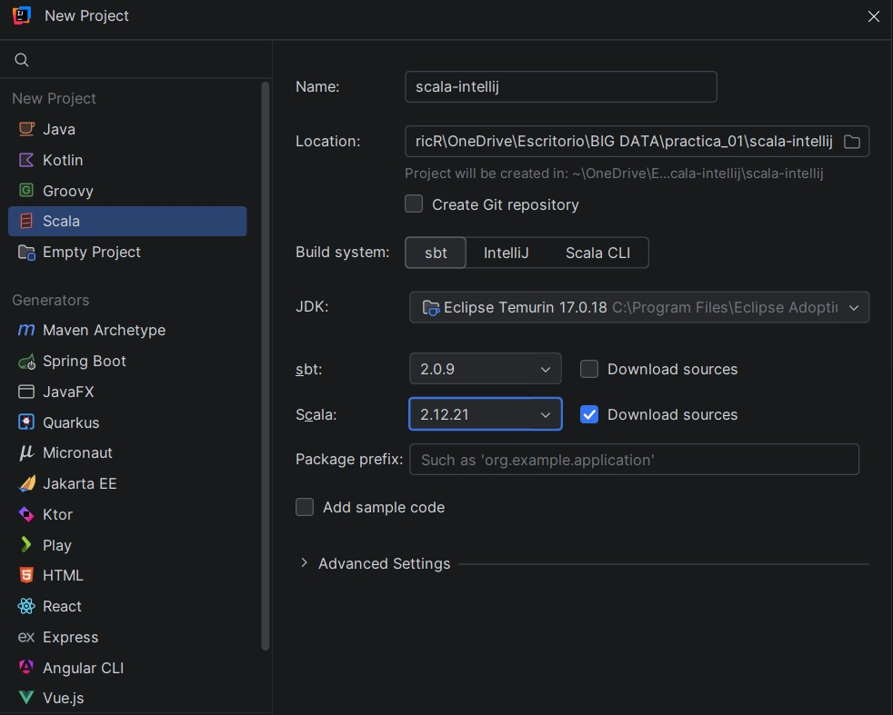 
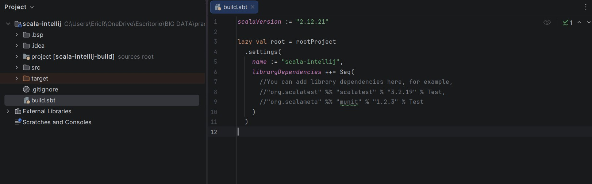 
 
### Ejecuci¢n desde el IDE 
Ejecución del objeto Main desde las herramientas integradas del IDE: 
 
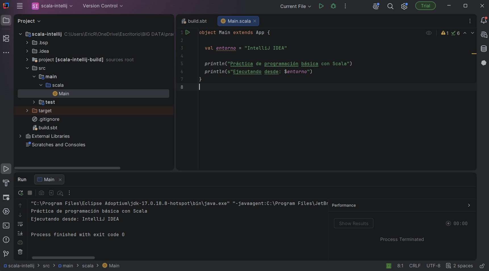 
 
### Resolución de PowerShell y sbt run 
Resolución del entorno en terminal para reconocer sbt y posterior compilación y ejecución con sbt run: 
 
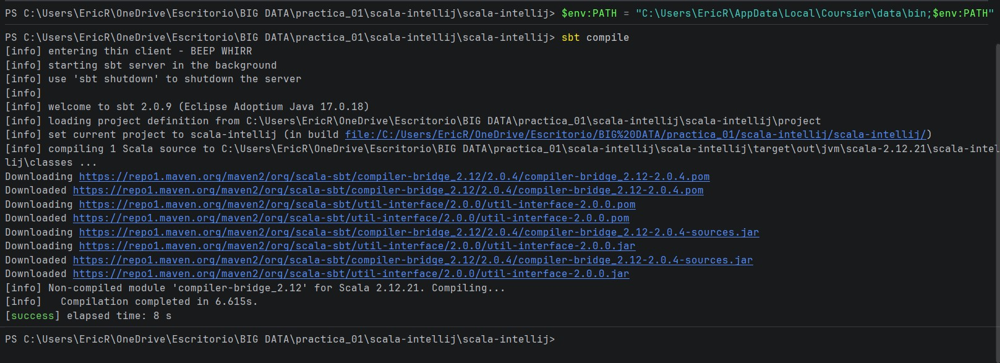 
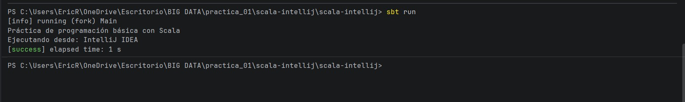
