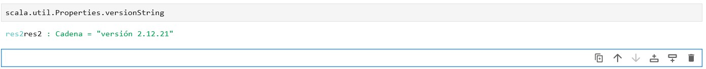
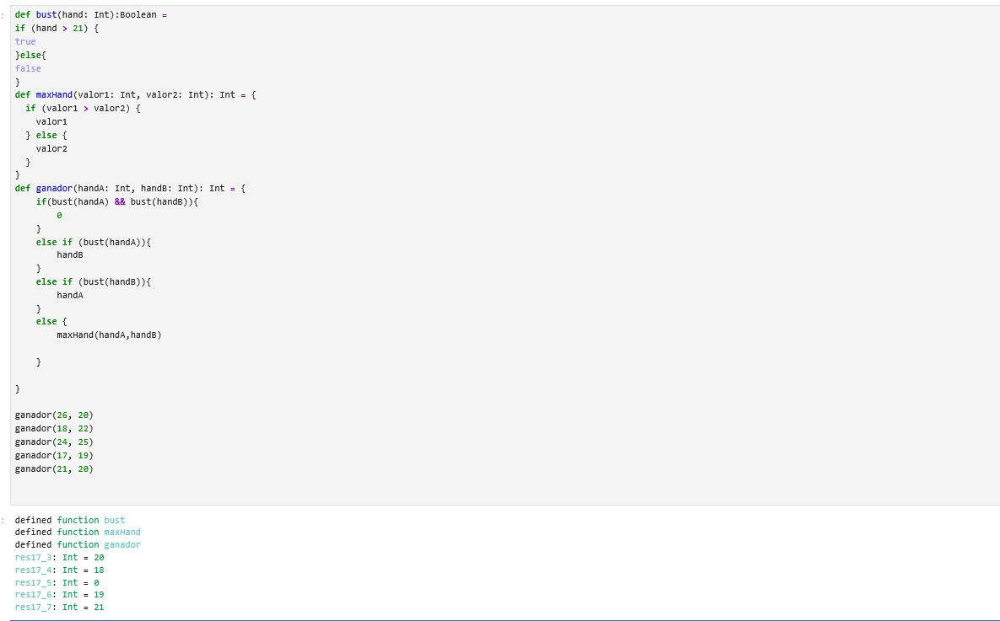

# Práctica 01 — Parte 2: Fundamentos de Scala y Programación Funcional

## Verificación de la versión de Scala

Comprobamos si la versión de Scala es la que se requiere:



---

## Ejercicio 1 — Variables, tipos e inferencia


### Documentación

1. **Tipos inferidos por Scala:**
* `nombre`: inferido como `String` al asignarle una cadena de texto entre comillas dobles.
* `partidas`: inferido como `Int` al recibir un número entero literal.
* `puntuacion`: inferido como `Int` al recibir un número entero literal.
* `tasaVictorias`: inferido como `Int` al asignarle el número 67 sin decimales (si se escribe 67.0, Scala lo infiere automáticamente como `Double`).
* `jugadorActivo`: inferido como `Boolean` al asignarle el valor reservado `true`.


2. **Diferencias observadas entre ambas versiones:**
* **Sintaxis:** La Versión B es más limpia y directa porque elimina código redundante sin perder la seguridad del tipado.
* **Tipado estático:** En las dos versiones las variables quedan fuertemente tipadas; una vez inferido el tipo en la Versión B, el compilador no permite asignarle otro tipo de dato distinto.
* **Precisión numérica:** Al no indicar el tipo explícito en `tasaVictorias` y poner 67, Scala infiere un entero (`Int`) en lugar de un decimal (`Double`), perdiendo los decimales salvo que se ponga un punto como 67.0.


3. **Variables que deberían ser val y cuáles podrían ser var:**
* **Variables `val` (inmutables):** La variable `nombre` debe ser `val` porque la identidad del jugador no cambia a lo largo de la partida.
* **Variables `var` (mutables):** Las variables `partidas`, `puntuacion`, `tasaVictorias` y `jugadorActivo` deberían ser `var` porque representan el estado dinámico del juego, el cual va cambiando, sumando puntos o cambiando de estado conforme se juegan rondas.


---

## Ejercicio 2 — val, var y reasignación

Se definieron dos identificadores para analizar la diferencia entre mutabilidad e inmutabilidad en Scala: `jugador` mediante la palabra clave `val` y `puntuacion` mediante `var`. Se realizaron incrementos aritméticos sucesivos sobre `puntuacion` mostrando su valor acumulado final, y posteriormente se forzó la reasignación de `jugador` para verificar la protección del compilador frente a modificaciones sobre valores inmutables.


### Documentación

1. **Por qué puntuación puede modificarse:** La variable `puntuacion` fue declarada utilizando la palabra clave `var`, lo que indica que es una variable mutable. En Scala, las variables mutables permiten reasignarles nuevos valores en cualquier momento a lo largo del ciclo de vida del programa, siempre que coincidan con el tipo de dato asignado originalmente (en este caso, `Int`).
2. **Por qué jugador no puede reasignarse:** El identificador `jugador` fue declarado utilizando `val`, lo que significa que es un valor inmutable (equivalente a una constante o variable final). Una vez inicializado con la cadena `"Marta"`, la referencia queda fijada en memoria y el compilador prohíbe terminantemente asociarle un nuevo valor.
3. **Qué mensaje genera Scala al intentar modificar un val:** Al intentar reasignar la variable inmutable mediante la instrucción `jugador = "Eric"`, el compilador de Scala detiene la compilación y genera el siguiente mensaje de error exacto: `reassignment to val Compilation Failed`. Este error confirma que la inmutabilidad es comprobada y garantizada directamente en tiempo de compilación para prevenir efectos secundarios no deseados.

---

## Ejercicio 3 — Tipos numéricos y precisión

En este ejercicio he probado la precisión de los números decimales en Scala usando `Double` y `Float` con el número pi lleno de decimales. También he declarado variables con los tipos básicos más comunes (`Int`, `Boolean` y `String`) para ver cómo maneja el lenguaje cada tipo de dato.


### Documentación

1. **Qué diferencia observas entre Double y Float:** La diferencia principal está en el tamaño en memoria y la precisión de los decimales. `Double` utiliza 64 bits (doble precisión) y es capaz de mantener unos 15-17 dígitos significativos, por eso en la salida conserva casi todos los decimales que introduje. En cambio, `Float` usa 32 bits (simple precisión) y solo mantiene unos 6-7 dígitos, redondeando y descartando el resto. Además, Scala interpreta cualquier decimal como `Double` de forma predeterminada; si queremos asignarlo a un `Float`, nos obliga a añadir una 'f' al final del número para no dar error de tipo.
2. **Qué tipo utilizarías para representar el número de estudiantes de una clase:** Utilizaría el tipo `Int`. El número de alumnos es un valor discreto y entero (no existen 24,5 estudiantes ni partes de una persona), y además cabe de sobra dentro del rango de un entero de 32 bits sin necesidad de gastar memoria en decimales.
3. **Qué tipo utilizarías para representar si un estudiante ha aprobado:** Utilizaría el tipo `Boolean`. Es una condición binaria que solo admite dos estados posibles en la lógica del programa: verdadero (ha aprobado / `true`) o falso (ha suspendido / `false`).

---

## Ejercicio 4 — Función para determinar si una mano se pasa de 21

En este ejercicio he definido la función `bust`, la cual recibe por parámetro el valor de una mano como un entero (`Int`) y devuelve un valor booleano (`Boolean`). Dentro de la función utilizo una estructura condicional `if / else` para evaluar si la puntuación es estrictamente mayor que 21, devolviendo `true` si el jugador se ha pasado y `false` si la mano sigue siendo válida (menor o igual a 21). La función cumple con los principios de estilo funcional al no modificar variables externas y limitarse a retornar el resultado de la evaluación lógica. Finalmente, he realizado las llamadas de prueba pasando las puntuaciones 18, 21, 22 y 30, obteniendo la secuencia esperada: `false`, `false`, `true` y `true`.


---

## Ejercicio 5 — Comparación de dos manos

En este ejercicio he implementado la función `maxHand`, que recibe dos parámetros enteros (`valor1` y `valor2`) y devuelve el valor numérico más alto utilizando una estructura de control condicional `if / else`. He realizado las llamadas de prueba pasando pares de valores con distintas combinaciones: cuando el segundo es mayor (17 y 19), cuando el primero es mayor (20 y 18), y dos casos donde ambas manos tienen exactamente la misma puntuación (21 y 21, y 30 y 30).


### Documentación

1. **Qué sucede cuando ambas manos tienen el mismo valor:** Cuando se pasan dos puntuaciones iguales (por ejemplo, 21 y 21), la condición del bloque `if` evalúa si `valor1` es estrictamente mayor que `valor2` (21 > 21), lo cual resulta en `false`. Al no cumplirse la condición, el flujo de ejecución pasa automáticamente al bloque `else` y devuelve `valor2`. Numéricamente el resultado es correcto (devuelve 21), pero la función no distingue semánticamente si hubo un ganador claro o si se produjo un empate entre ambos jugadores.
2. **Posible mejora del comportamiento y decisión tomada:** Para mantener un diseño funcional limpio y ceñido a los contenidos del curso, he decidido conservar la función devolviendo un `Int`. Si quisiéramos contemplar explícitamente el caso de empate, podríamos añadir una rama intermedia mediante `else if (valor1 == valor2)` que devuelva un valor específico acordado (por ejemplo, 0 para indicar empate técnico) o mostrar un mensaje por consola. Sin embargo, para la mecánica de comparar manos de cartas basta con devolver el valor numérico empatado, ya que representa la puntuación más alta alcanzada en la mesa.

---

## Ejercicio 6 — Decidir el ganador de una partida

En este ejercicio he implementado la función `ganador`, la cual recibe dos puntuaciones enteras (`handA` y `handB`) y determina cuál resulta vencedora según las normas del juego. Para modularizar y reutilizar código, he integrado la función `bust` del ejercicio 4 para comprobar si las manos sobrepasan 21, y la función `maxHand` del ejercicio 5 dentro del bloque `else` para resolver el desempate cuando ninguna de las dos se pasa. Se evaluaron con éxito los cinco casos de prueba solicitados por el enunciado.



### Documentación: Análisis de condiciones cumplidas en cada caso de prueba

1. **Caso `ganador(26, 20)` $\rightarrow$ Resultado: 20:** Se cumple la condición `else if (bust(handA))`. Explicación: La primera mano supera el límite ($26 > 21$) mientras que la segunda es válida ($20 \le 21$), por lo que gana automáticamente `handB`.
2. **Caso `ganador(18, 22)` $\rightarrow$ Resultado: 18:** Se cumple la condición `else if (bust(handB))`. Explicación: La segunda mano se pasa de 21 ($22 > 21$) y la primera permanece dentro del rango reglamentario, por lo que gana automáticamente `handA`.
3. **Caso `ganador(24, 25)` $\rightarrow$ Resultado: 0:** Se cumple la primera condición `if (bust(handA) && bust(handB))`. Explicación: Ambas puntuaciones son estrictamente superiores a 21, por lo que los dos jugadores quedan descalificados y la función devuelve 0.
4. **Caso `ganador(17, 19)` $\rightarrow$ Resultado: 19:** Se cumple la rama final `else`. Explicación: Ninguno de los dos jugadores supera 21, por lo que se delega en la función `maxHand(17, 19)`, la cual evalúa que 19 es mayor y devuelve dicha mano ganadora.
5. **Caso `ganador(21, 20)` $\rightarrow$ Resultado: 21:** Se cumple la rama final `else`. Explicación: Ambas manos son válidas al no exceder el límite, delegando en `maxHand(21, 20)`, que devuelve 21 como la puntuación más alta.

---

## Ejercicio 7 — Arrays y mutabilidad

En la primera celda declaré un array inmutable en su referencia llamado `jugadores` utilizando la palabra clave `val`, inicializado con tres cadenas de texto: `"Alex"`, `"Chen"` y `"Marta"`. A continuación, accedí a la posición inicial mediante su índice cero y sustituí `"Alex"` por `"Sindhu"`, demostrando que el contenido interno de un array puede modificarse. En la segunda celda repetí el proceso e intenté asignar el número entero 500 en la posición cero con `jugadores(0) = 500`, provocando un error en tiempo de compilación para comprobar la seguridad del sistema de tipos estático de Scala.


### Documentación

1. **Por qué los elementos del array pueden cambiar aunque la variable se haya declarado con val:** La palabra clave `val` hace que la referencia de la variable sea inmutable. Esto significa que la variable `jugadores` siempre estará vinculada al mismo espacio de memoria asignado al array y nunca podrá apuntar a una colección distinta. Sin embargo, en Scala los arrays son estructuras de datos de longitud fija pero mutables en su contenido. Por ello, el compilador permite modificar los valores individuales almacenados en cada una de sus posiciones a través de sus índices sin quebrantar la inmutabilidad de la variable `val`.
2. **Por qué Scala no permite introducir el valor 500 en un Array[String]:** Scala cuenta con un sistema de tipado estático y estricto. Al crear el array con elementos de texto, el compilador infirió automáticamente que su tipo de dato es `Array[String]`. Como se observa claramente en la salida del error rojo, al intentar ejecutar `jugadores(0) = 500`, el compilador detiene la ejecución arrojando el mensaje: `type mismatch; found: Int(500), required: String`. Esto ocurre porque cada celda de memoria de esta estructura está reservada exclusivamente para almacenar cadenas de texto, rechazando cualquier intento de guardar un tipo numérico incompatible como `Int`.
3. **Diferencia entre reasignar la variable y modificar un elemento del array:**
* **Reasignar la variable:** Consistiría en hacer que el identificador `jugadores` apunte a un objeto o array completamente diferente en la memoria (por ejemplo, escribiendo `jugadores = Array("Otro")`). Esta acción está prohibida porque la variable se declaró con `val`.
* **Modificar un elemento del array:** (Como al ejecutar `jugadores(0) = "Sindhu"`) no altera la referencia ni crea un nuevo array; simplemente actualiza el valor concreto almacenado dentro de una posición existente de la estructura.


---

## Ejercicio 8 — Creación e inicialización de Arrays

En este ejercicio he instanciado un array de 4 posiciones para enteros utilizando la sintaxis `new Array[Int](4)`. Después asigné de forma manual las puntuaciones de cada jugador en sus respectivos índices (del 0 al 3) con los valores 17, 24, 21 y 19. Por último, utilicé la propiedad `.length` para comprobar el tamaño total de la estructura, obteniendo una longitud de 4.


### Documentación

* **¿Qué valores contiene un Array[Int] recién creado antes de asignar manualmente sus elementos?**
Un `Array[Int]` recién creado se inicializa automáticamente con el valor por defecto del tipo numérico entero, que es `0` en todas sus posiciones. En este caso concreto de longitud 4, antes de realizar las asignaciones manuales, el array contiene internamente: `Array(0, 0, 0, 0)`.

---

## Ejercicio 9 — Recorrer un Array con while

En este ejercicio he recorrido una colección de puntuaciones almacenadas en un array utilizando una estructura de control iterativa `while`. He definido un contador mutable con `var i = 0` para llevar el índice de posición y he establecido como condición de parada que el índice sea menor que la longitud total del array mediante la propiedad `.length`. En cada iteración se extrae el elemento correspondiente, se evalúa a través de la función `bust` para verificar si supera 21 y se imprime el resultado formateado por consola, finalizando con el incremento manual del contador mediante `i += 1`.


### Documentación

1. **Funcionamiento del control de flujo con bucle while:** El bucle evalúa la condición booleana `i < manos.length` al inicio de cada iteración. Mientras el índice se encuentre dentro de los límites válidos del array (de 0 a 4), se ejecuta el bloque de código interno. La variable `i` debe ser declarada obligatoriamente como `var` para permitir su incremento manual en cada vuelta. Cuando `i` alcanza el valor 5, la condición resulta `false` y el bucle termina, habiendo procesado exactamente todos los elementos de forma secuencial.
2. **Enfoque imperativo vs enfoque funcional:** Este método de iteración representa un estilo de programación puramente imperativo, ya que requiere gestionar manualmente el estado y la mutabilidad del índice (`var i`), con el riesgo añadido de provocar un bucle infinito si se olvida incrementar el contador o un error `IndexOutOfBoundsException` si la condición de parada no es estricta.

---

## Ejercicio 10 — Listas e inmutabilidad

En este ejercicio he creado una lista inmutable llamada `jugadores` con tres elementos de tipo `String`. Posteriormente utilicé el operador cons (`::`) para anteponer `"Sindhu"` al inicio de la lista y almacenar el resultado en una nueva variable llamada `jugadoresNuevos`. Mostré ambas listas por pantalla junto a sus longitudes con `length` para verificar que la lista original no sufrió alteraciones, e imprimí `jugadoresNuevos.reverse` para mostrar la nueva lista en orden inverso.


### Documentación

1. A diferencia de un `Array` (cuyo contenido interno es mutable y permite sobrescribir posiciones directamente mediante índices), una `List` en Scala es completamente inmutable por diseño. Ninguna operación sobre una lista modifica la estructura original en memoria; cualquier adición o transformación genera obligatoriamente una nueva lista.
2. **Qué devuelve la operación :: y qué ocurre con la lista original:** El operador cons (`::`) añade un elemento al principio de la lista y devuelve una nueva instancia de `List[String]` que contiene dicho elemento más los de la lista previa. La lista original (`jugadores`) permanece 100% intacta e inalterada, manteniendo sus 3 elementos iniciales tal como demuestran las impresiones y la comprobación de longitudes (4 frente a 3).

---

## Ejercicio 11 — Construcción y concatenación de listas

En este ejercicio he construido dos listas utilizando la lista vacía `Nil` combinada con el operador cons (`::`), asociando los elementos de derecha a izquierda: `listaNil` con tres elementos (`"Ana"`, `"Luis"`, `"Marta"`) y `listaNil2` con dos (`"Pedro"`, `"Sofia"`). Posteriormente utilicé el operador de concatenación (`:::`) para unir ambas colecciones en una nueva llamada `listaFinal`. Por último, imprimí por pantalla la lista resultante y las dos originales para validar el resultado.


---

## Ejercicio 12 — Operadores relacionales y lógicos

En este ejercicio he evaluado distintas expresiones booleanas a partir de tres puntuaciones enteras (`handA = 18`, `handB = 21`, `handC = 25`). He puesto a prueba tanto operadores relacionales (mayor que `>`, igualdad `==`, desigualdad `!=`) como operadores lógicos combinados (conjunción `&&`, disyunción `||` y negación `!`). Cada resultado booleano se ha almacenado en una variable inmutable e impreso por pantalla mediante interpolación de cadenas `s"..."` para verificar su evaluación.


### Documentación

| Expresión | Resultado | Explicación |
| --- | --- | --- |
| `handA > handB` | `false` | 18 no es estrictamente mayor que 21. |
| `handB == 21` | `true` | El valor de handB es exactamente igual a 21. |
| `handC != 21` | `true` | El valor de handC (25) es distinto de 21. |
| `(handA <= 21) && (handB <= 21)` | `true` | Ambas condiciones son verdaderas ($18 \le 21$ y $21 \le 21$). |
| `(handA > 21) || (handC > 21)` | `true` | Aunque la primera condición es falsa ($18 > 21$), la segunda es verdadera ($25 > 21$). |
| `!(handB == 21)` | `false` | La expresión interna evalúa a true, y el operador de negación invierte el valor a false. |

---

## Ejercicio 13 — foreach y funciones como valores

En este ejercicio he implementado dos enfoques distintos para recorrer la colección de manos: el primero utilizando un bucle tradicional `while` con control manual de índice, y el segundo empleando el método de orden superior `foreach` mediante una función anónima con bloque de llaves. En ambos casos se evalúa si cada puntuación supera el límite de 21, comprobando las diferencias sintácticas y conceptuales entre el paradigma imperativo y el declarativo.


### Documentación

* **Cuál necesita un contador:** La versión con el bucle `while`. Requiere definir y gestionar un índice manual (`i`) para acceder a cada elemento por su posición y controlar la condición de parada frente a `manos.length`. En cambio, `foreach` abstrae el acceso posicional y entrega directamente cada elemento `mano` sin necesidad de contadores.
* **Cuál necesita una variable var para recorrer la colección:** La versión con `while`. Para avanzar en cada iteración es indispensable declarar `var i = 0` y mutar su valor con `i += 1` en cada vuelta. La versión con `foreach` no utiliza ninguna variable mutable (`var`); el parámetro `mano` es tratado internamente como un valor inmutable en cada paso.
* **Cuál se aproxima más al estilo funcional presentado en el material del curso (Datacamp):** La versión con `foreach`. Se ajusta plenamente al paradigma funcional porque evita la mutabilidad del estado (no usa `var`), elimina el riesgo de bucles infinitos o desbordamientos de índice, y adopta un enfoque declarativo donde se le indica a la colección qué acción ejecutar sobre sus datos en lugar de instruir paso a paso cómo iterar la memoria.

---

## Ejercicio 14 — Efectos secundarios y estilo de programación

En este ejercicio he implementado y contrastado dos formas opuestas de estructurar una operación de suma. En la primera parte utilicé una función con enfoque imperativo que no retorna ningún valor útil (devuelve `Unit`) y altera repetidamente el estado de una variable externa mutable declarada con `var`. En la segunda parte diseñé una función pura denominada `sumar`, la cual recibe dos parámetros de entrada y devuelve un nuevo resultado entero como expresión directa sin alterar ningún estado fuera de su propio cuerpo.


### Documentación

| Característica | `sumarAlTotal` | `sumar` |
| --- | --- | --- |
| Modifica datos externos | Sí (modifica la variable global `total`) | No (solo utiliza sus parámetros locales) |
| Devuelve un resultado calculado | No (devuelve `Unit` / sin retorno útil) | Sí (devuelve un entero `Int` con el cálculo) |
| Utiliza efecto secundario | Sí (muta el estado fuera de la función) | No (es una función pura) |
| Estilo predominante | Imperativo | Funcional |

---

## Ejercicio 15 — Programa integrado: torneo de Twenty-One

He implementado la simulación del torneo integrando colecciones, funciones personalizadas y estructuras de control. En la Ronda 1 usé un bucle `while` con indexación manual para comprobar cada mano con la función `bust`, vincularla al jugador correspondiente y calcular la puntuación máxima válida con `maxHand`. En la Ronda 2 utilicé el método `foreach` con una función anónima para evaluar la validez de cada puntuación y actualizar la mejor marca del torneo.


### Documentación

* **Qué partes de tu solución son mutables:** Las variables declaradas con `var`: el índice contador `i` y las variables acumuladoras `mejorPuntuacionR1` y `mejorPuntuacionR2`, cuyos valores se van reasignando a medida que se procesan las rondas. Asimismo, el contenido interno de los arrays (`manos` y `manosRonda2`) es técnicamente mutable.
* **Qué partes son inmutables:** La colección `jugadores` (de tipo `List`), las referencias `val` a los arrays y listas, así como los valores locales definidos dentro de las iteraciones (`jugador`, `puntuacion`, `sePasa`) y los parámetros pasados a las funciones.
* **Dónde utilizas funciones:** En las definiciones propias `bust` (para evaluar si una mano supera 21) y `maxHand` (para determinar el valor más alto entre dos enteros), además de los métodos estándar de colecciones como `foreach` y la función de salida `println`.
* **Dónde utilizas estructuras de control:** En el bucle `while` de la Ronda 1 y en las sentencias condicionales `if / else` empleadas dentro del cuerpo de las funciones `bust` y `maxHand`, así como en los bloques de evaluación de ambas rondas.
* **Qué parte de tu solución consideras más cercana al estilo funcional:** Las funciones puras `bust` y `maxHand` (no modifican estado externo ni tienen efectos secundarios) y el recorrido de la Ronda 2 mediante `foreach`, que itera directamente sobre los elementos sin requerir índices ni contadores manuales.
* **Qué parte consideras más cercana al estilo imperativo:** El bucle `while` de la Ronda 1, ya que requiere gestionar manualmente el avance del índice (`i += 1`) y mutar variables de estado externas (`mejorPuntuacionR1`) paso a paso.

```

```
