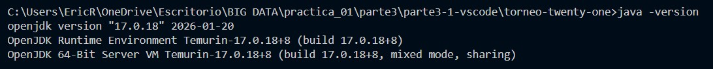

# Mini proyecto 3.1 — Clasificador de resultados de un torneo de Twenty-One

## Entorno de trabajo

- **Editor / IDE:** Visual Studio Code
- **Language Server:** Scala (Metals)
- **Versión de Scala:** 2.12.21
- **Máquina Virtual:** Java Development Kit 17 (Eclipse Adoptium Temurin 17.0.18)
- **Herramienta de compilación:** sbt 1.13.0

### Verificación y configuración del entorno

Para garantizar la compatibilidad del ecosistema sbt con Scala 2.12.21, se configuró el entorno local asegurando el uso estricto de JDK 17 mediante las variables del sistema y la directiva `metals.javaHome`.

#### 1. Verificación de JDK 17
Comprobación de la versión activa de OpenJDK en la terminal integrada:



#### 2. Verificación de Scala 2.12.21
Comprobación de la versión de Scala ejecutada mediante la propiedad interna `scala.util.Properties.versionString`:


---

## Descripción del proyecto

Este mini proyecto implementa un sistema automatizado de procesamiento y clasificación de jugadas para un torneo del juego de cartas **Twenty-One** (Blackjack simplificado). 

El objetivo principal es procesar colecciones paralelas de datos (jugadores y puntuaciones) a lo largo de dos fases eliminatorias consecutivas. El sistema evalúa individualmente el estado de la mano de cada jugador, realiza recuentos estadísticos grupales mediante acumuladores, determina de forma algorítmica la mejor mano válida y compara el rendimiento entre rondas utilizando estructuras de control imperativas y funcionales.

---

## Estructura del proyecto

El proyecto respeta la organización canónica de aplicaciones gestionadas por sbt:

```text
torneo-twenty-one/
├── build.sbt
├── project/
│   ├── build.properties
│   └── metals.sbt
├── src/
│   └── main/
│       └── scala/
│           └── Main.scala
├── images/
│   ├── parte3-java-version.jpg
│   ├── parte3-version-Scala.jpg
│   ├── parte3-funcion-bust.jpg
│   ├── parte3-funcion-estadoMano.jpg
│   ├── parte3-funcion-mejorMano.jpg
│   ├── parte3-%20sbt-compile.jpg
│   └── parte3-%20sbt-run.jpg
└── README.md
