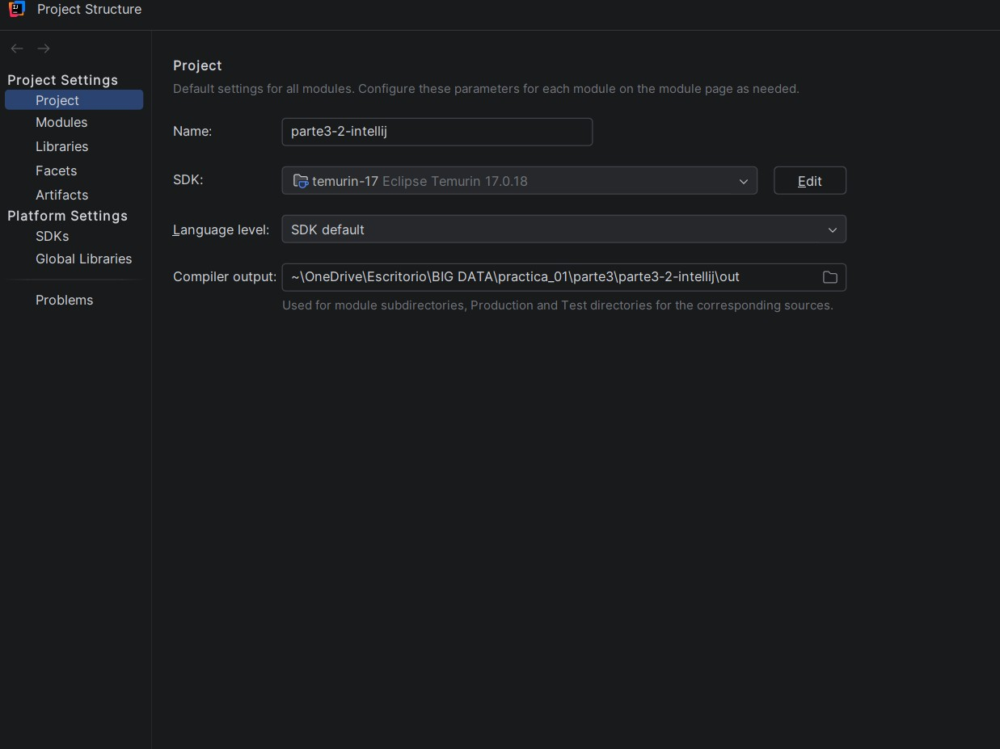
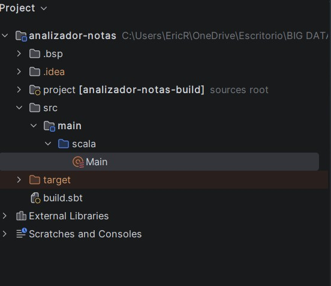
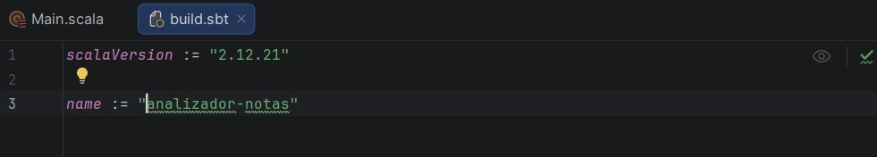
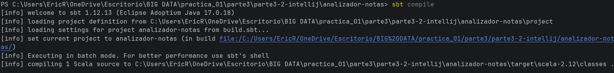
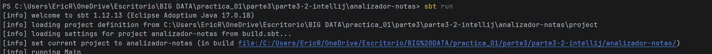
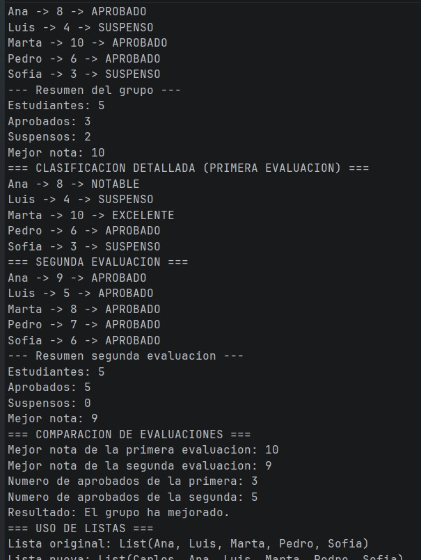

# Practica 01 - Parte 3.2: Analizador de Calificaciones (IntelliJ IDEA)

Este subproyecto implementa una aplicacion en Scala para el procesamiento y analisis estadistico de calificaciones academicas, estructurada y gestionada con sbt dentro del entorno IntelliJ IDEA.

---

## 1. Configuracion del entorno en IntelliJ IDEA

Para la correcta ejecucion del proyecto se configuro el SDK de Java con Eclipse Temurin 17 y la version correspondiente del lenguaje Scala.

---

## 2. Estructura del proyecto

El proyecto respeta la jerarquia estandar de un proyecto sbt:

3. Archivo build.sbt
Definicion de metadatos y version de Scala en build.sbt:

Scala    
scalaVersion := "2.12.21"

name := "analizador-notas"
4. Implementacion modular (Main.scala)
Se implementaron funciones puras y estructuras de control segun los requisitos:

aprobado(nota: Int): Boolean: Determina si la calificacion es mayor o igual a 5.

estadoNota(nota: Int): String: Devuelve "APROBADO" o "SUSPENSO" invocando a aprobado.

maxNota(a: Int, b: Int): Int: Retorna el valor maximo entre dos notas mediante if-else.

clasificacion(nota: Int): String: Clasifica cualitativamente cada calificacion (EXCELENTE, NOTABLE, APROBADO, SUSPENSO).

5. Inmutabilidad y manejo de Listas
En el apartado de colecciones se incorpora un estudiante al inicio de la lista mediante el operador de cons (::):

Scala
val nuevosEstudiantes = "Carlos" :: estudiantes
Justificacion tecnica
En Scala, List es una estructura de datos inmutable. El operador :: crea una nueva lista anteponiendo el nuevo elemento y reutilizando la estructura existente (comparticion estructural en memoria). Por este motivo, la lista original estudiantes permanece intacta sin verse alterada ni generar efectos secundarios.

6. Compilacion y Ejecucion con sbt
Compilacion (sbt compile)
Compilacion limpia y exitosa desde la terminal:

Ejecucion (sbt run)
Lanzamiento de la tarea de ejecucion del proyecto:

Salida completa del programa
Resultado arrojado en consola con las dos evaluaciones, estadisticas, comparacion de grupos y validacion de inmutabilidad:

